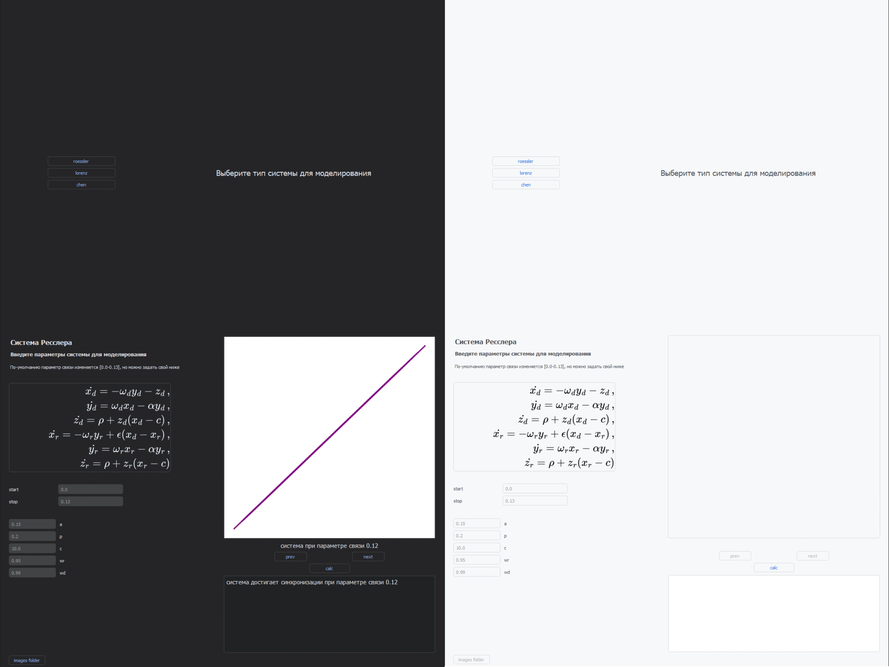

# About
Win32 application for modelling dynamic systems and using image recognition to detect synchronisation.

# How to use

## Ready-To-Use Builds
Download the latest release from [releases](https://github.com/icosane/vervain/releases).

## Building Locally/using your own libraries
You can also run it using the ```.py``` files. 
>
Use ```syncdetect_local``` to run it in your IDE of choice. It expects all the additional files from ```/assets``` in the same directory. 
>
Use ```syncdetect_executable``` to build it using [pyinstaller](https://pyinstaller.org/en/stable/) or [auto-py-to-exe](https://pypi.org/project/auto-py-to-exe/). 
>
For ```auto-py-to-exe``` you can use my build template ```build_settings_git.json```.

## Keras Model used in this project
The file is too large to commit. Can be downloaded [here](https://github.com/icosane/vervain/releases/tag/v0.5) instead.
>
Use ```sync_model.keras```

# Libraries used in this project

- [darkdetect](https://github.com/albertosottile/darkdetect) by Alberto Sottile
- [matplotlib](https://github.com/matplotlib/matplotlib) by Matplotlib
- [numpy](https://github.com/numpy/numpy) by numpy
- [Pillow](https://github.com/python-pillow/Pillow) by python-pillow 
- [PyQt5](https://pypi.org/project/PyQt5/) by Riverbank Computing 
- [pyqtdarktheme](https://github.com/5yutan5/PyQtDarkTheme) by 5yutan5
- [scipy](https://pypi.org/project/scipy/) by SciPy
- [tensorflow](https://github.com/tensorflow/tensorflow) by Google Brain Team

Icon from [veryicon](https://www.veryicon.com) by [zuozuozuozuo](https://www.veryicon.com/icons/miscellaneous/standard-general-linear-icon/sync-18.html)

# UI Overview



